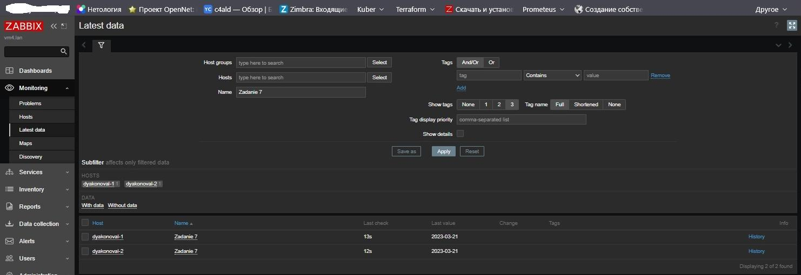

# Домашнее задание к занятию "`9.3 «Система мониторинга Zabbix. Часть 2»`" - `Дьяконов Алексей`

### Задание 1

-1. `Создан template с названием "Zadanie 1"`
-2. `Создан в template "Zadanie 1" item "CPU load"`
-3. `Создан в template "Zadanie 1" item "memory load"`

-

### Задания 2-3

-1. `Установлен zabbix-agent 2 на 2 виртуальные машины`
-2. `В файл  /etc/zabbix/zabbix-agent2.conf добавлен адрес сервера заббикс`
-3. `Созданы хосты на сервере заббикса (Configuration > Hosts ). Прикреплены templates "Zadanie 1" и "Linux by Zabbix Agent"`

-
-
-

### Задание 4

`Создан dasboard "Zadanie 4". Добавлены 2 графика, карта и часы`

-

### Задание 5

-1. `Создана карта `
-2. `Добавлены 2 хоста и сервер. Настроен линки. (Не забывать нажимать apply)`

##### Все хосты доступны

-

##### Один из хостов не доступен

-

### Задание 6

##### Скрипт:

#!/bin/bash
if [[ $1 -eq 1 ]];
 then
     echo " Дьяконов А.Л. "
elif [[ $1 -eq 2 ]]; 
 then
     echo $(date +%D)
fi
-1. `Создан скрипт up.sh `
-2. `Скрипт добавлен на оба хоста в /etc/zabbix`
-3. `Создан файл /etc/zabbix/zabbix-agent2.d/test-bash.conf с содержимым "UserParameter=Custom_echo[*], bash /etc/zabbix/up.sh $1" `

#####  $1 = 1:

-
-

#####  $1 = 2:

-
-

### Задание 7

##### Скрипт:
import sys
import os
import re
import datetime

if (sys.argv[1] == '-ping'): # Если -ping
       result=os.popen("ping -c 1 " + sys.argv[2]).read() # Делаем пинг по заданному адресу
       result=re.findall(r"time=(.*) ms", result) # Выдёргиваем из результата время
       print(result[0]) # Выводим результат в консоль
elif (sys.argv[1] == '-simple_print'): # Если simple_print
       print(sys.argv[2]) # Выводим в консоль содержимое sys.arvg[2]
elif (sys.argv[1] == '1'):
       print("Дьяконов А.Л") 
elif (sys.argv[1] == '2'):
       print (datetime.date.today())
else: # Во всех остальных случаях
       print(f"unknown input: {sys.argv[1:]}") #Выводим непонятый запрос в консоль 

-1. `Изменён скрипт из лекции `
-2. `Скрипт добавлен на оба хоста в /etc/zabbix`
-3. `Создан файл /etc/zabbix/zabbix-agent2.d/test_user_parameter.confс содержимым "UserParameter=echo1[*], python3 /etc/zabbix/test_python_script.py $1 $2" `

#####  $1 = 1:

-

#####  $1 = 1:

-

#####  $1 = -ping, $2 = netology.ru:

-

#####  $1 = -simple_print, $2 = simple_print:

-

